# Capstone Project: Compare Consumer Sentiments of Apple, Google, and Android from Past to Present

**Instructor:** James Irving  
**Date:** 7/23/21

## Contents
 - <a href='#BusinessProblem'> Business Problem </a>
 - <a href='#Datacollection'> Data Collection </a>
 - <a href='#DataCleaning'> Data Cleaning </a>
 - <a href='#DataModeling'> Data Modeling</a>
 - <a href='#WordCloud'> Word Cloud</a>
 - <a href='#Recommendation'> Recommendation </a>
 - <a href='#Conclusion'> Conclusion </a>

 

## Business Problem
For better or worse, people's perception of tech giants have changed over time. A company that consults these large companies' PR teams have hired me to find how the consumers' sentiments have changed. To gather the necessary information, I am going to go to Twitter, and I will compare the public's emotion towards these companies using vader sentiment analysis. 

## Data Collection

The old Twitter data were provided, but for the new Twitter data, I used tweepy and Twitter's developer API to collect 1,500 recent tweets for each of the three companies: Apple, Google, and Android.  

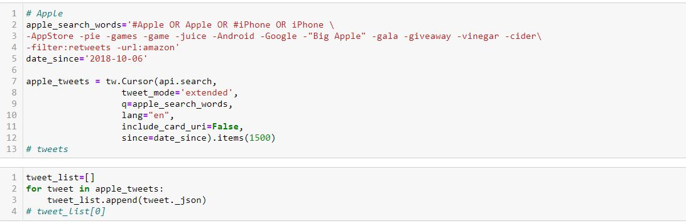 
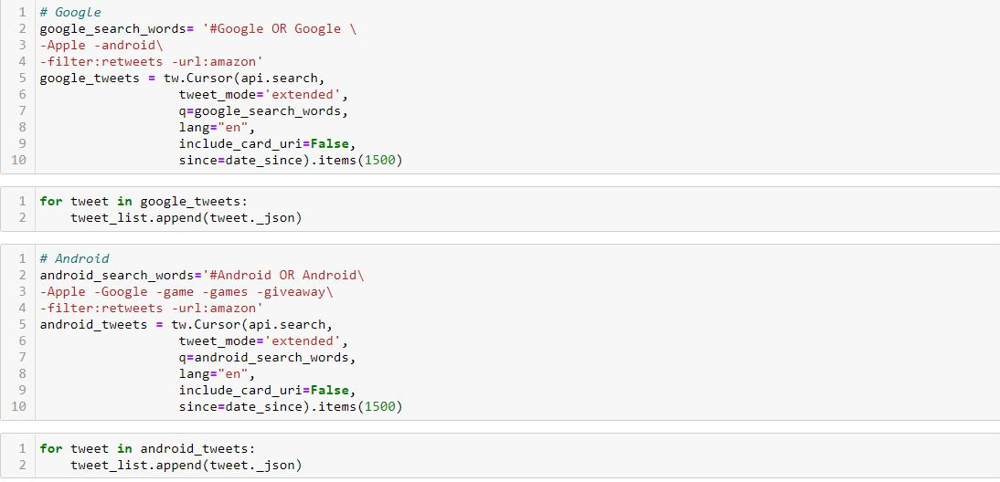 

I also decided that it would be best to exclude tweets that contained more than one company names, and for Apple, since there were multiple related words/phrases, more filtering had to be done. 

## Data Cleaning
First, I had to create a text cleaner to help get rid of non asc-ii characters and other pieces of strings that I did not need. 
 
I noticed that many of the tweets did not contain any product or company names. Using regular expression, I looked for the company names in the text and gave values to the product or company column. 
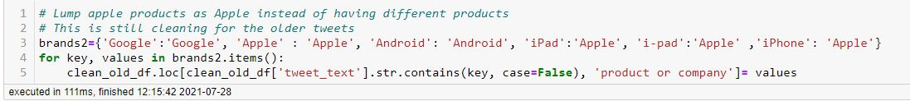 
For rows that already contained a company name or product name, I decided to reduce the number of options into three: Apple, Google, and Android.

### VADER Sentiment Analysis
From the VADER sentiment analysis, I collected the 'compound' values as they represented the most accurate sentiment depiction. If the values were bigger than or equal to .05, it was considered positive; if less than or equal to -.05, negative; and the rest were considered neutral.   
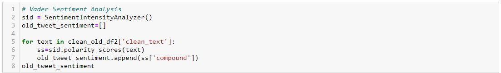
The following shows the distribution of the sentiments.  
Old Tweet 
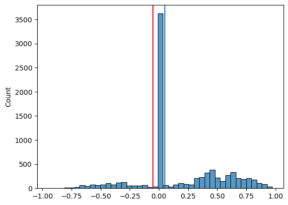 
New Tweet 
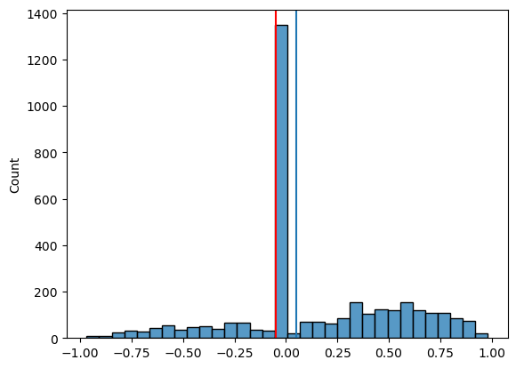 

From these distributions I noticed that 0 was the most common sentiment value and that the number of negative tweets were much lower those of positive and neutral tweets. 
Old Tweet 
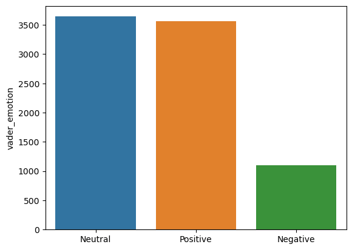 
New Tweet 
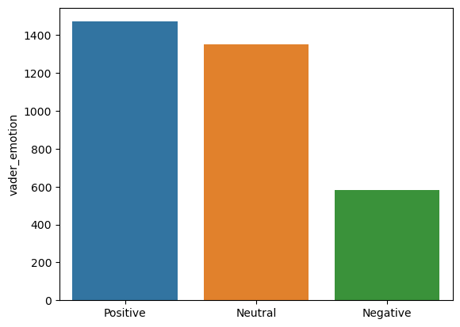 

When I compared the initially given emotion of the tweets to the emotion results from vader sentiment analysis, only slightly more than half of the tweets' sentiment had been correctly identified.
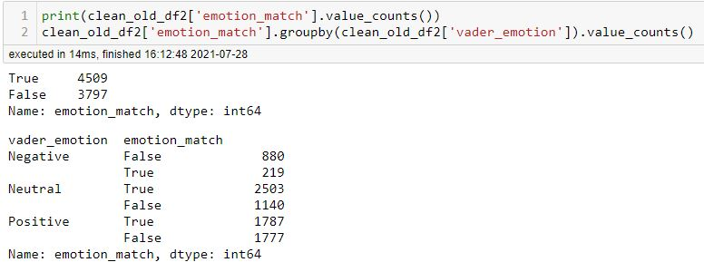

### Tokenizing and Stop Words
For NLP analysis, it is important to have a token list. Token list is splitting a text file into words or characters. 
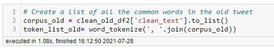 
Using this, I created a frequency distribution plot of the most commonly used words/characters 
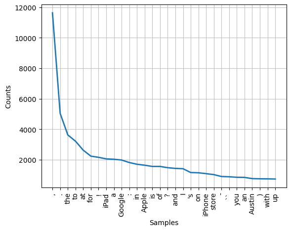 
Then I created a list of common stopwords, added punctuations, as well as the company names and other common Twitter terms. 
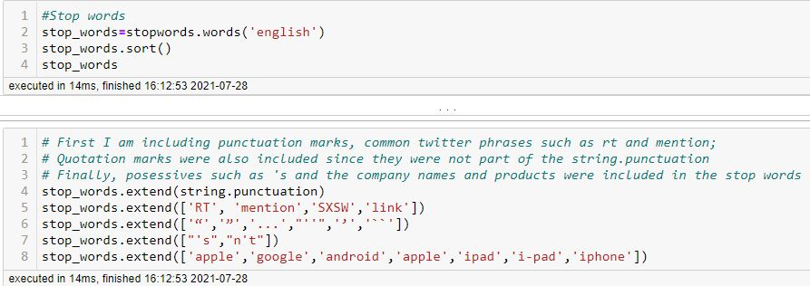 
First, I created a horizontal frequency distribution plot that used a token list from both the old and new tweets, then I created the same frequency distribution plot that used the stop words. 
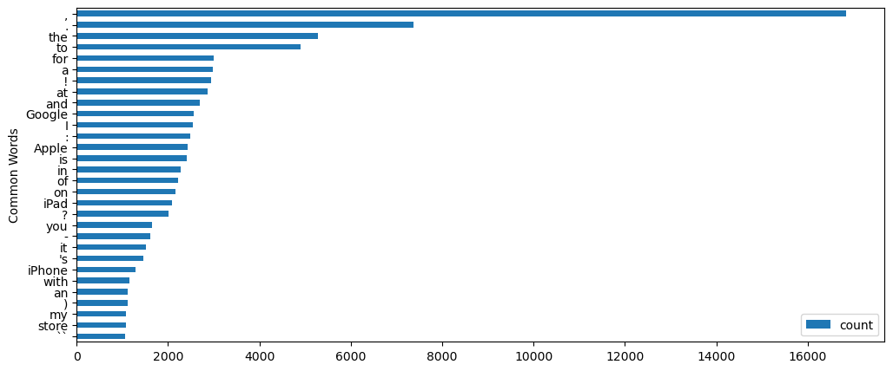 
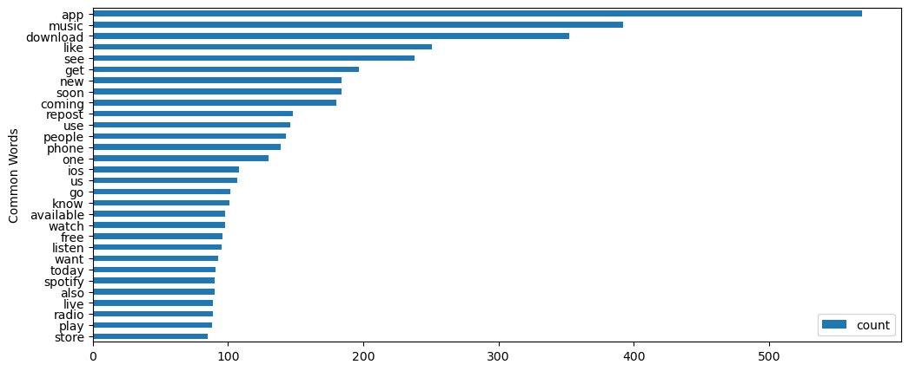 

## Data Modeling
For modeling, I chose Random Forest and Naive Bayesian models. I chose them because they were the best fit for doing NLP analysis. The random forest models for both the old and new tweets were created without any parameters at first, then it was pipelined, then refined again using GridSearch CV. In general, the recall score for the negative tweets were much lower than those of its counterparts. This is becaus, as mentioned before, the total number of negative tweets were much smaller than those of positive tweets or neutral tweets. 
### Random Forest
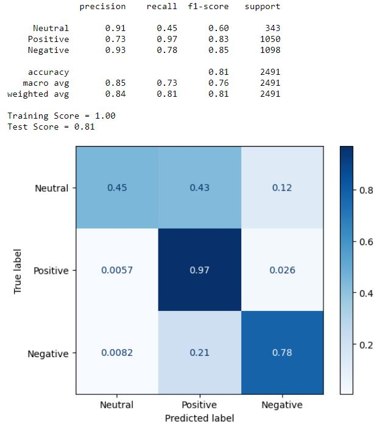 
#### Old Tweet Random Forest with grid search 
Along with the confusion matrix of the models, I found the important features that the random forest model used to determine the texts' sentiment. In this case, the important features are words that helped the model determine sentiments. Each of the graph shows 30 most important features/words. Words such as like, free, love, and best were near the top for both old and new tweets.  
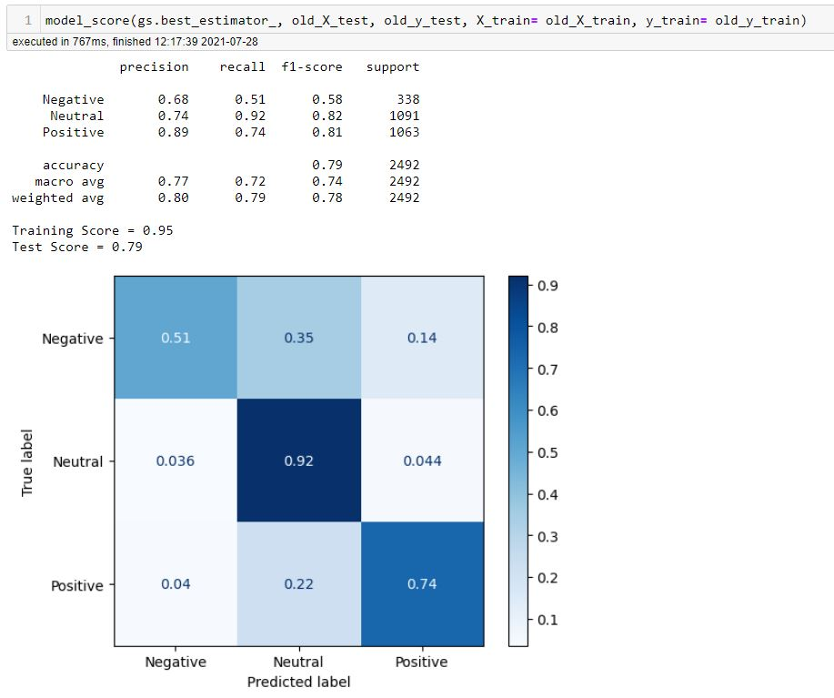 
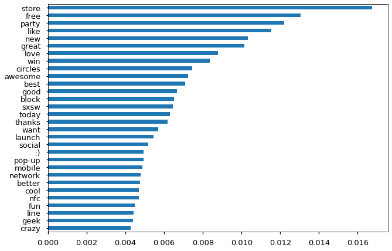 
#### New Tweet Random Forest with grid search  
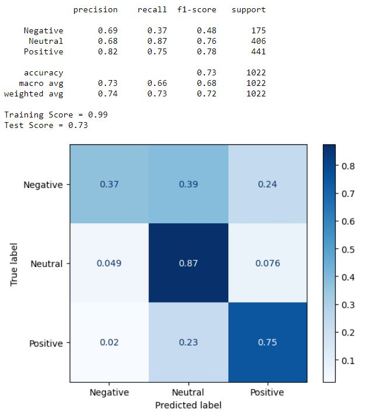 
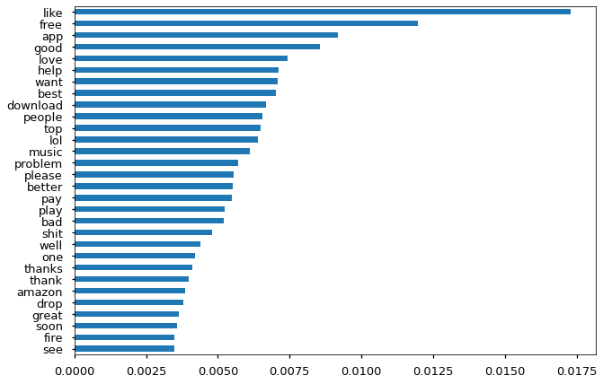 

### Naive Bayesian
Comapred to the random forest models, the navie bayesian models did not perform as well, especially before performing the grid search. 
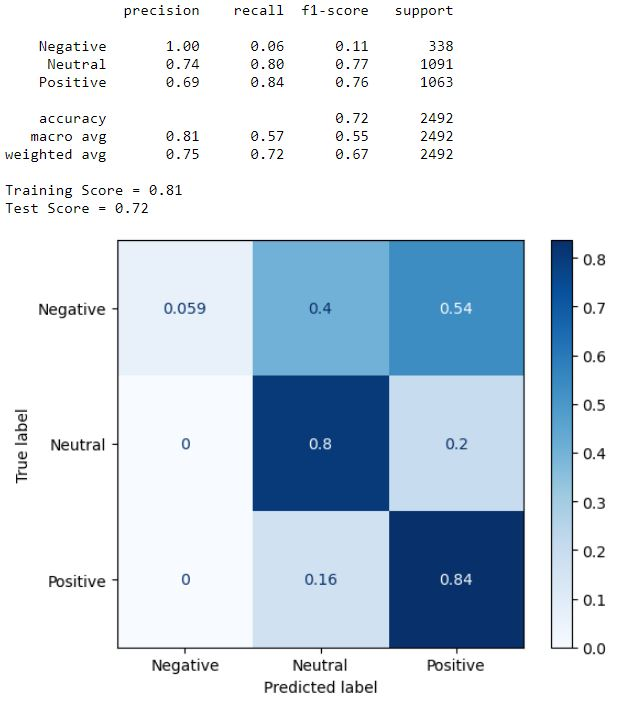 
As can be seen, the recall score for the negative tweets are extremely low. This however improves after performing the grid search. 
#### Old Naive Bayesian with grid search  
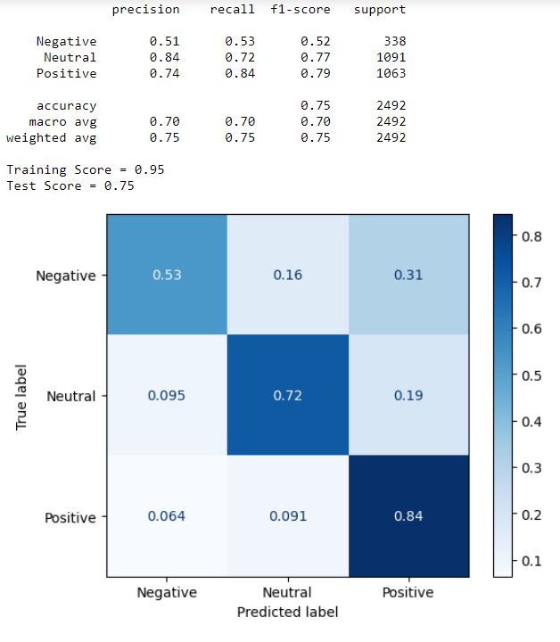 
#### New Naive Bayesian with grid search  
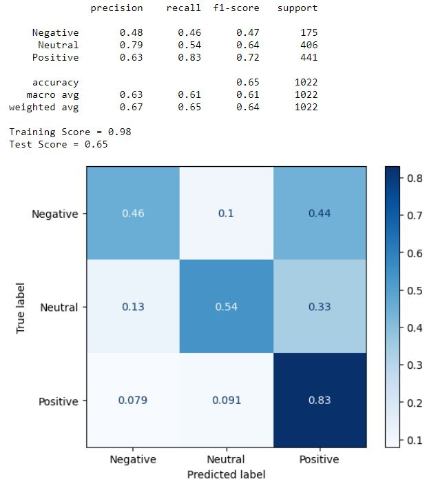 
While the recall scores for the naive bayesian models with grid search are decent, the recall score for the neutral tweets from the new tweets are significantly lower than those of the random forest even though the number of neutral tweets were large. 

## Word Cloud
Using the tokens and stop words from above, I created some word clouds. The first two images of word clouds show common words from the tweets that had positive sentiment towards Apple in the old and new tweets.  
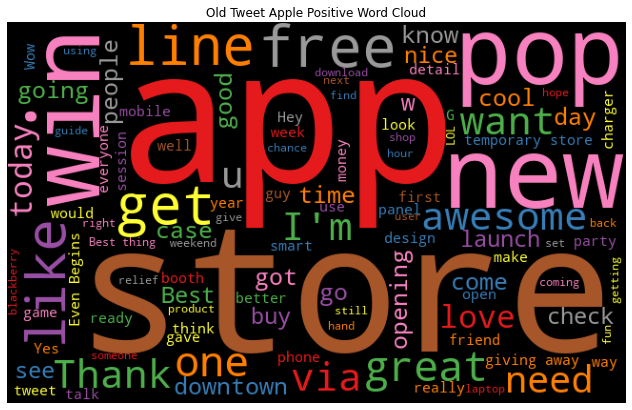 
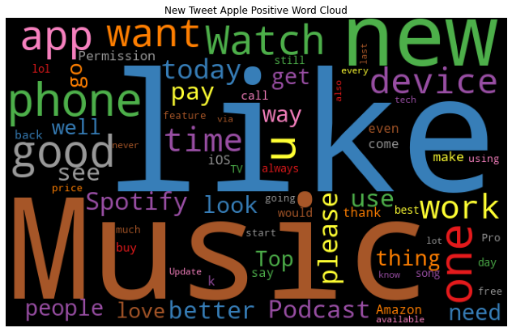 
These are some of the most commonly appearing words in the word clouds that show how and why the sentiment towards the company has changed. These words and reason(s) for the sentiment change will be provided after each set of word cloud. 
 - Old Tweet: store, app, line, opening, win, great, Thank, want
 - New Tweet: music, like, phone, Spotify, want, Watch
 - Words associated with positive sentiment seems to change from one's experience at the Apple store or using their product apps such as Apple Music or Spotify. 
 

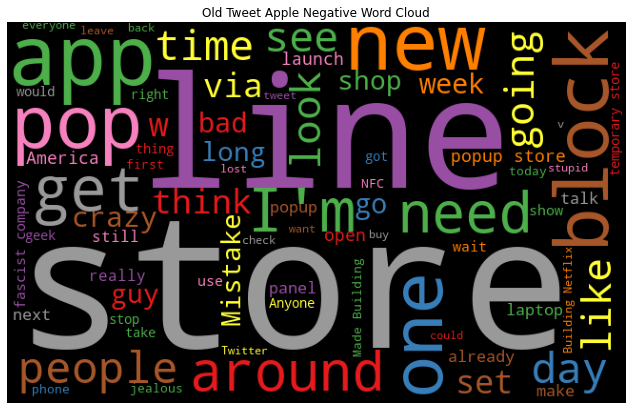 
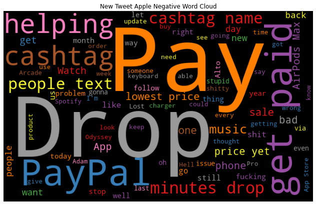 

 - Old Tweet: store, line, block, need, crazy
 - New Tweet: price yet, people text, problem, stop, minutes drop
 - As with before, the negative sentiment towards Apple has shifted from the Apple experience to people's discontent towards Apple's products and prices. 
 - Cashtag, get paid, cashtag name are all from advertisements that use an app called Cashpay. PayPal also seems to be associated with advertisements. 
 

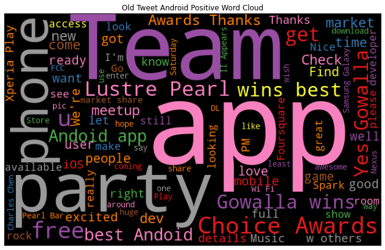 
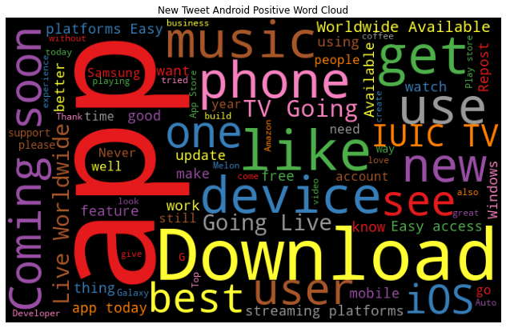 
 - Old Tweet: Team, App, wins best, phone, best Android
 - New Tweet: app, music phone, device, Easy access
 - Like the tweets about Apple, people seem to use their phones for music apps more. 
 - From the wording in the old tweets, there is a rivalry between the users of Android phones and iPhone users, which we can no longer observe in the new tweets.
 
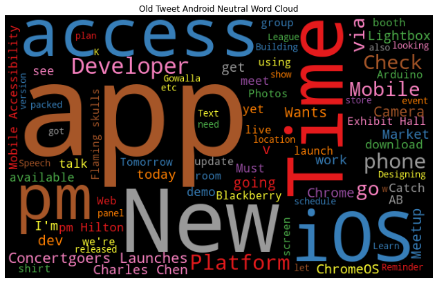 
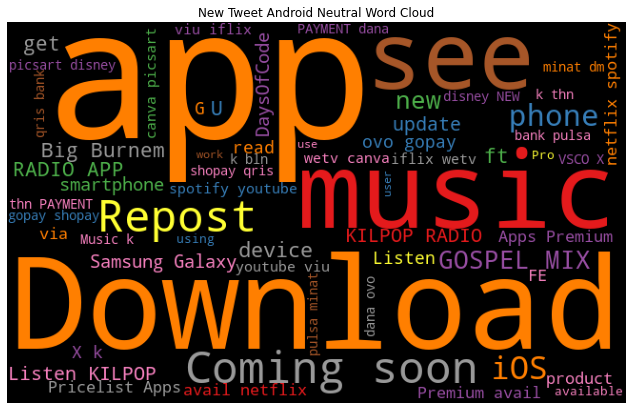 
 - Old Tweet: app, New, Time, iOS, access, Platform, ChromeOS
 - New Tweet: app, music, Download, RADIO APP, iOS
 - Both old and new tweets seem to focus on Android apps, and judging form the word iOS, these tweets seem to either compare the type of apps or show the availability in both the Google Play Store and the iOS App Store. 
 
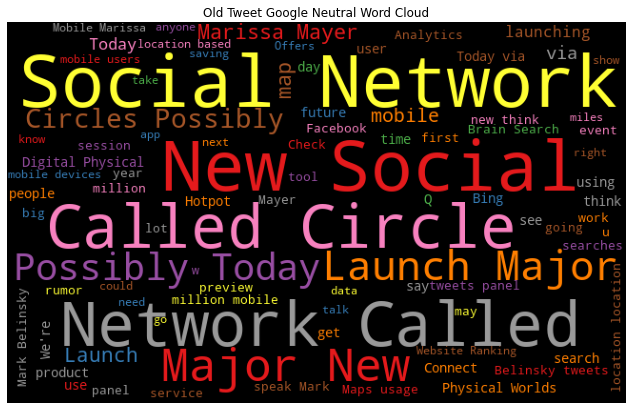 
 
 - Old Tweet: New Social, map, great, party, Social Network
 - New Tweet: like, know, use, see, help, search, find
 - Overall, the number of words related to positive sentiment towards Google seems to have decreased. 
 - Similar to the tweets with neutral sentiment, new tweets seem to be more related to the Google's search engine rather than Google as a company. 
 

 
 
 - Old Tweet: Social Network, Major New, Possibly Today, Launch
 - New Tweet: Search, New, use, map, soft detection, translate
 - Neutral sentiment towards Google seems to have shifted from texts relating to social media to general uses of the Google search engine. 
 

## Model Recommendation

For both of the tweets, the Random Forest models after the gridsearch performed the best. The random forest models before the pipeline and the models after performing the grid search performed similarly; however, because the low recall score for the negative tweets were improved to that of the original random forest models while maintaining the relatively high recall scores for the neutral and positive tweets, I recommend the **Random Forest models using gridsearch**.
As mentioned before, the number of tweets with negative sentiments were only a third of the size of either the positive or neutral neutral tweets which led to the poor recall rate of negative tweets for all models. 

## Conclusion

### Future Work
There are many things that I would like to incorporate into this project that I did not have the necessary skills or time to perform, but given the chance I would like to do these for the future:
1. Collect similar amounts of tweets for all three sentiments
    - This would help improve the recall scores for the models and maybe give an insight as to why the naive bayesian models did not perform as well before gridsearch.
2. Create a time line of sentiments and events.
    - By collecting tweets from the past throughout to the present, I would be able to show how the sentiment trends gradually changes.
    - Incorporating events from the past could also help understand the sentiment trends and highlight specific actions that the company had taken that negatively or positively impacted the public's sentiment.
    

### Final thoughts
This project was an adventure from the start as I had to learn how to collect my own data. Another aspect that I had not experienced before was the lengthy text cleaning that came with using tweets. And while the old tweet data were provided, I had to use the vader sentiment analysis as I had noticed much of the tweets did not correctly represent the tweet's sentiment. The aspect that most intrigued me about the Twitter sentiment towards these large companies is the obviously smaller number of negative emotion towards the companies and the overwhelming number of neutral sentiments towards them as well. I had initially expected to see a large increase in negative sentiment towards companies such as Apple as they have become less consumer friendly in their product designs. And as mentioned above in the future works section, I believe that creating a time line of the sentiment changes and events could help paint a clearer picture of how much these companies have changed in their policies and in the eyes of the consumers. 